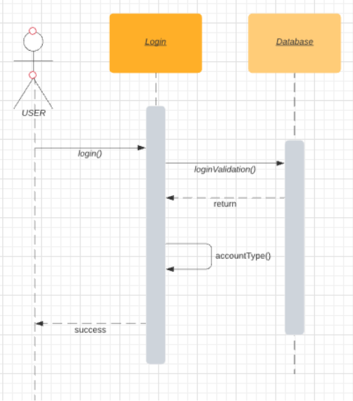

# Part 2: Analysis

## 2.1 Activity Diagram

The first part of our analysis is an activity diagram, which is shown below.

We can see it has two loops. Whenever a user accesses our system, they can either access an admin account or a customer account. If they manage to log in, the system will confirm their identities and show them the different modules they have access to.

## 2.2 Use Case Diagram

We designed 7 use cases for the system, which contains almost all of its functions. They are:

- Login
- Create Account
- Update Account
- Change Username/Password
- Input Payment Credentials
- Manage Transactions
- Access Stored Credentials

## 2.3 Use Case Descriptions

<table><tbody><tr><th colspan="2">
<strong>Use Case Name: </strong>Login
</th><th>
<strong>ID:</strong> 1
</th><th>
<strong>Importance Level: </strong>high
</th></tr><tr><td>
<strong>Primary Actor: </strong>User
</td><td colspan="3">
<strong>Use Case Type: </strong>Detail, Essential
</td></tr><tr><td colspan="4">
<strong>Stakeholders and Interests:</strong>

<strong></strong>Customer - wants to access the create account and update account modules

<strong></strong>Admin - wants to access the create account and update account modules
</td></tr><tr><td colspan="4">
<strong>Brief Description:</strong>

<strong></strong>This use case will explain how users will login to the system.
</td></tr><tr><td colspan="4">
<strong>Trigger: </strong>The user pressing the “login” button.

<strong>Type: </strong>External
</td></tr><tr><td colspan="4">
<strong>Relationships:</strong>

<strong>Association: </strong>admin, customer

<strong>Include: </strong>update account, create account, input payment credentials, access stored credentials, manage transactions

<strong>Extend:</strong>

<strong>Generalization:</strong>
</td></tr><tr><td colspan="4">
<strong>Normal Flow of Events:</strong>
<ol><li>The user clicks on the login button and is redirected to login page</li><li>The user enters username and password credentials.</li><li>The username and password are verified. If verified as Customer, the S-1: login as customer subflow is performed. If verified as Admin, the S-2: login as Admin subflow is performed.</li><li>The user clicks the logout button to log out.</li></ol></td></tr><tr><td colspan="4">
<strong>SubFlows:</strong>

<strong>S-1: </strong>login as customer
<ul><li>The user will see buttons “update account”, “input payment credentials”, “access stored credentials”, “manage transactions”.</li></ul>
<strong>S-2: </strong>login as admin
<ul><li>The user will see “create account”, and “update account” buttons.</li></ul></td></tr><tr><td colspan="4">
<strong>Alternate/Exceptional Flows:</strong>

<strong>3a1:</strong> the username and/or password is not valid

<strong>3a2:</strong> the system displays an error page

<strong>3a3:</strong> the user is redirected to the home page
</td></tr></tbody></table>

<table><tbody><tr><th colspan="2">
<strong>Use Case Name: </strong>Create Account
</th><th>
<strong>ID: </strong>2
</th><th>
<strong>Importance Level: </strong>high
</th></tr><tr><td>
<strong>Primary Actor: </strong>Customer/Admin
</td><td colspan="3">
<strong>Use Case Type:</strong> Detail, essential
</td></tr><tr><td colspan="4">
<strong>Stakeholders and Interests:</strong>

<strong></strong>Customer - wants to access the create account module to access input payment credentials module

<strong></strong>Admin - wants to access the create account module to access manage transactions module
</td></tr><tr><td colspan="4">
<strong>Brief Description: </strong>This use case describes how the customer or admin can create a new account in order to access various modules that require an account.
</td></tr><tr><td colspan="4">
<strong>Trigger: </strong>The user clicks on “create new account” button on the login screen.

<strong>Type: </strong>External
</td></tr><tr><td colspan="4">
<strong>Relationships:</strong>

<strong>Association: </strong>Customer, Admin

<strong>Include: </strong>input payment credentials

<strong>Extend:</strong>

<strong>Generalization:</strong>
</td></tr><tr><td colspan="4">
<strong>Normal Flow of Events:</strong>
<ol><li>User clicks on the “create new account” button on the login page.</li><li>User inputs credentials and credentials are verified. If the user is an administrator, S-1: the account creation as admin subflow is performed. If the user is not an admin account, S-2: the account creation as normal customer subflow is performed.</li><li>The user clicks the logout button.</li><li>The user is returned to the home page.</li></ol></td></tr><tr><td colspan="4">
<strong>SubFlows:</strong>

<strong>S-1:</strong> Account creation as administrator
<ol><li>User selects “Create account”.</li><li>User selects elevated account creation.</li></ol>
<strong>S-2:</strong> Account creation as normal customer
<ol><li>User selects “Create Account”.</li><li>User selects basic account creation.</li><li>User has the option to input payment credentials.</li></ol></td></tr><tr><td colspan="4">
<strong>Alternate/Exceptional Flows:</strong>

<strong>3a1:</strong> Username or password doesn’t meet the specified criteria

<strong>3a2:</strong> Username already linked with another account

<strong>3a3:</strong> System displays an error page
</td></tr></tbody></table>

<table><tbody><tr><th colspan="2">
<strong>Use Case Name: </strong>Update Account
</th><th>
<strong>ID: </strong>3
</th><th>
<strong>Importance Level: </strong>high
</th></tr><tr><td>
<strong>Primary Actor: </strong>User/Admin
</td><td colspan="3">
<strong>Use Case Type:</strong> Detail, essential
</td></tr><tr><td colspan="4">
<strong>Stakeholders and Interests:</strong>

<strong></strong>Customer - wants to access and update account modules

<strong></strong>Admin - wants to access and update account modules
</td></tr><tr><td colspan="4">
<strong>Brief Description: </strong>This use case describes how the customer or admin can update their account.
</td></tr><tr><td colspan="4">
<strong>Trigger: </strong>The user clicks on “update account” button in account settings.

<strong>Type: </strong>External
</td></tr><tr><td colspan="4">
<strong>Relationships:</strong>

<strong>Association: </strong>Customer, Admin

<strong>Include: </strong>Update username/password

<strong>Extend:</strong>

<strong>Generalization:</strong>
</td></tr><tr><td colspan="4">
<strong>Normal Flow of Events:</strong>
<ol><li>User logs in with username and password.</li><li>User is taken to the home page.</li><li>User clicks on the “Account Settings” button.</li><li>User selects the “Update Username/Password” button.</li><li>User enters new credentials.</li><li>System prompts the user that the account is updated.</li></ol></td></tr><tr><td colspan="4">
<strong>SubFlows:</strong>
</td></tr><tr><td colspan="4">
<strong>Alternate/Exceptional Flows:</strong>

<strong>3a1:</strong> Username/password doesn’t meet the specified criteria

<strong>3a2:</strong> Username/password already linked with another account

<strong>3a3:</strong> System displays an error page

<strong>3a4</strong>: Username/Password same as previous Username/Password
</td></tr></tbody></table>

<table><tbody><tr><th colspan="2">
<strong>Use Case Name: </strong>Input Payment Credentials
</th><th>
<strong>ID:</strong> 4
</th><th>
<strong>Importance Level: </strong>high
</th></tr><tr><td>
<strong>Primary Actor: </strong>User
</td><td colspan="3">
<strong>Use Case Type: </strong>Detail, Essential
</td></tr><tr><td colspan="4">
<strong>Stakeholders and Interests:</strong>

<strong></strong>Customer - wants to input payment credentials to pay for goods
</td></tr><tr><td colspan="4">
<strong>Brief Description:</strong>

<strong></strong>This use case will explain how users will login to the system.
</td></tr><tr><td colspan="4">
<strong>Trigger: </strong>User accessing “Account Settings” and pressing “Add Payment Method” button.

<strong>Type: </strong>External
</td></tr><tr><td colspan="4">
<strong>Relationships:</strong>

<strong>Association:</strong> Customer

<strong>Include:</strong>

<strong>Extend:</strong>

<strong>Generalization:</strong>
</td></tr><tr><td colspan="4">
<strong>Normal Flow of Events:</strong>
<ol><li>User logs into account.</li><li>Accesses Account Settings and presses “Add Payment Method”.</li><li>User inputs payment information on a secure page. System confirms the information is correct.</li><li>User has now added a new payment method.</li></ol></td></tr><tr><td colspan="4">
<strong>SubFlows:</strong>
</td></tr><tr><td colspan="4">
<strong>Alternate/Exceptional Flows:</strong>

<strong>3a1:</strong> the payment information is not correct or invalid

<strong>3a2:</strong> the system displays an error page
</td></tr></tbody></table>

<table><tbody><tr><th colspan="2">
<strong>Use Case Name: </strong>Access Stored Credentials
</th><th>
<strong>ID:</strong> 5
</th><th>
<strong>Importance Level: </strong>high
</th></tr><tr><td>
<strong>Primary Actor: </strong>Customer
</td><td colspan="3">
<strong>Use Case Type: </strong>Detail, Essential
</td></tr><tr><td colspan="4">
<strong>Stakeholders and Interests:</strong>

<strong></strong>Customer - wants to access stored credentials on their account
</td></tr><tr><td colspan="4">
<strong>Brief Description:</strong>

This use case describes how customers can view their stored credentials
</td></tr><tr><td colspan="4">
<strong>Trigger: </strong>User accessing “Account Settings” and pressing “View Account Information” button

<strong>Type: </strong>External
</td></tr><tr><td colspan="4">
<strong>Relationships:</strong>

<strong>Association:</strong> Customer

<strong>Include:</strong>

<strong>Extend:</strong>

<strong>Generalization:</strong>
</td></tr><tr><td colspan="4">
<strong>Normal Flow of Events:</strong>
<ol><li>User logs into account</li><li>Accesses “Account Settings”</li><li>Presses ”View Account Information” button</li><li>User now has access to their Stored Credentials</li></ol></td></tr><tr><td colspan="4">
<strong>SubFlows:</strong>
</td></tr><tr><td colspan="4">
<strong>Alternate/Exceptional Flows:</strong>

<strong>3a1:</strong> The system displays an error page
</td></tr></tbody></table>

##

##

<table><tbody><tr><th colspan="2">
<strong>Use Case Name: </strong>Manage Transactions
</th><th>
<strong>ID:</strong> 6
</th><th>
<strong>Importance Level: </strong>high
</th></tr><tr><td>
<strong>Primary Actor: </strong>Administrator
</td><td colspan="3">
<strong>Use Case Type: </strong>Detail, Essential
</td></tr><tr><td colspan="4">
<strong>Stakeholders and Interests:</strong>

<strong></strong>Administrator - wants to access table of all transactions in order to manage and edit them
</td></tr><tr><td colspan="4">
<strong>Brief Description:</strong>

This use case describes how administrator accounts can access all transactions from their store in order to manage them.
</td></tr><tr><td colspan="4">
<strong>Trigger: </strong>Admin accessing “View/Manage Transactions” from the administrative view of the home page

<strong>Type: </strong>External
</td></tr><tr><td colspan="4">
<strong>Relationships:</strong>

<strong>Association:</strong> Administrator

<strong>Include:</strong>

<strong>Extend:</strong>

<strong>Generalization:</strong>
</td></tr><tr><td colspan="4">
<strong>Normal Flow of Events:</strong>
<ol><li>User logs into admin account</li><li>Admin goes to home page</li><li>Presses ”View/Manage Transactions” button</li><li>User now has access to their store’s transactions</li></ol></td></tr><tr><td colspan="4">
<strong>SubFlows:</strong>
</td></tr><tr><td colspan="4">
<strong>Alternate/Exceptional Flows:</strong>

<strong>3a1:</strong> The system displays an error page
</td></tr></tbody></table>

## 2.4 Class Diagram

## 2.5 Sequence Diagrams
### 1\. Login

### 2\. Create Account

### 3\. Update Account

### 4\. Input Payment Credentials

### 6\. Manage Transactions  

